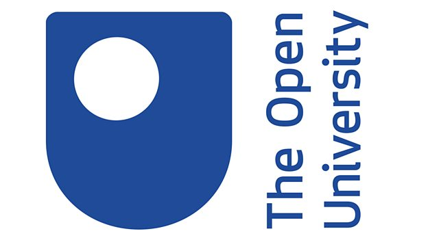
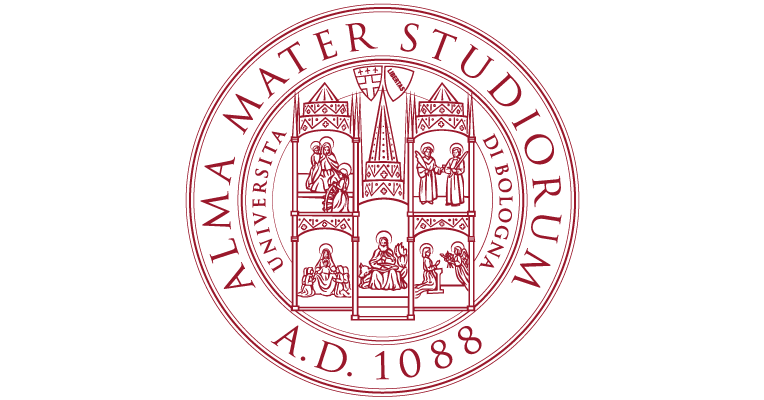
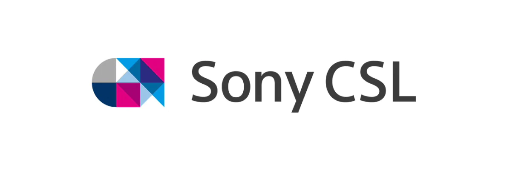

# Artificial Intelligence and Music (AIM)

## A DARIAH Working Group proposal

### Music and Artificial Intelligence

Music and Artificial Intelligence go back a long time. In the seminal paper in which Alan Turing proposed his famous test for identifying intelligent machine behaviour (Turing’s test), there are already multiple speculations on whether machines can understand and do music just as humans do. Nowadays, it is undoubted that machine intelligence can expand the ways humans experience and create music. In the last decades, various communities have addressed the fundamental questions, theories, systems and practical issues around music and intelligent systems, with varying degrees of success and areas of focus: automatic composition, procedural music generation, music learning, signal and symbolic feature extraction, semantic annotation of music, emotion detection, interactive musical experience between humans and computers, and so on. However, these fields have traditionally operated, and do so still currently, through highly segmented communities, between which scarce and only sporadic and unorganized interaction occurs.

### Who are we?

We are a community of enthusiastic academic researchers, industry practitioners and government institutions with a deep interest in strengthening all fronts of interaction between Music and Artificial Intelligence. The working group on Music and Artificial Intelligence (AIM) will advocate and seek for impact and outreach towards the goal of building artificial musical agents that collaborate with humans employing true musical intelligent behaviour through an organized community of practice. Thus, the goal of AIM is to connect and bring together individuals, groups, and institutions that do research and work around the different aspects of Music and AI, advocating a more cohesive Music & AI community, fostering outreach, and driving innovation in the field.

### Topics

This is an incomplete list of topics of interest to the WG:
- Computational musicology
- Music generative methods
- Symbolic and subsymbolic representations of music
- Computational music cognition
- Human computer interaction and music
- Music and Knowledge Representation & Reasoning
- Semantics and ontologies of music
- Music on the Web
- Music and Linked Data
- Preservation and archiving of digital music

### Means and tools

The WG provides the following to its participant members:
- A central web portal where every individual, group or institution can sign up to and state their interest with respect to Music and AI
- A mailing list to facilitate communication between all the community members
- A community-curated list and ontology of topics of interest

### Participants

This is a list of the current AIM participants:

- Albert Meroño Peñuela, Vrije Universiteit Amsterdam, the Netherlands -- [albert.merono@vu.nl](mailto:albert.merono@vu.nl)
- Aldo Gangemi, University of Bologna, Italy -- [aldo.gangemi@unibo.it](mailto:aldo.gangemi@unibo.it)
- Enrico Daga, The Open University, UK -- [enrico.daga@open.ac.uk](mailto:enrico.daga@open.ac.uk)
- Mathieu d’Aquin, Insight Centre for Data Analytics, Ireland -- [mathieu.daquin@insight-centre.org](mailto:mathieu.daquin@insight-centre.org)
- Robin Laney, The Open University, UK -- [robin.laney@open.ac.uk](mailto:robin.laney@open.ac.uk)
- Simon Holland, The Open University, UK -- [simon.holland@open.ac.uk](mailto:simon.holland@open.ac.uk)
- Royal Birmingham Convervatoire
- Sony CSL
- Soundreef

### Contact us

If you want to know more about AIM, or join the growing community of partners, contact us [here](mailto:albert.merono@vu.nl).
